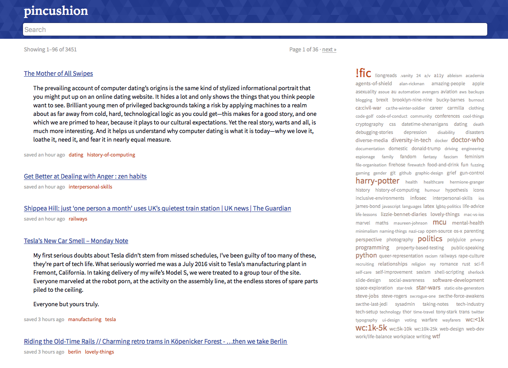

# pincushion

Pincushion is an alternative front-end and archiver for [Pinboard.in](https://pinboard.in).
It's not an alternative to Pinboard – it relies on it for bookmark storage and management.

It has a couple of features that suit my tastes:

*   Elasticsearch instead of SQL for search
*   Saved pages are archived in Amazon S3 rather than on the Pinboard servers, and immediately rather than several weeks later
*   A more mobile-friendly design

It runs as a standalone application on your own web server.

This is still very much a WIP – I threw together the prototype on Boxing Day, and I'm cleaning up the code/making it more comprehensible and tested.

Still to write:

*   Installation instructions
*   Architecture notes
*   Why?
